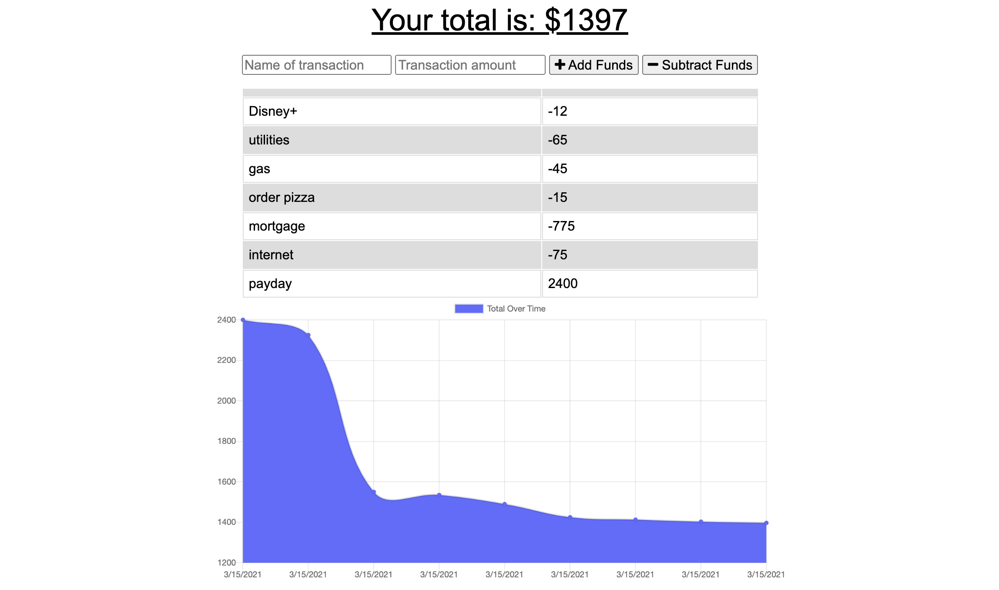

# Budget Tracker

## Description
This application tracks your budget whether you have a connection to an online network or not. Track the money you have as you go. No network? Enter your transactions anyway and as soon as you enter a network, the Budget Tracker will update automatically.

- Link: [Visit the Budget Tracker App here!](https://sheltered-basin-70418.herokuapp.com/)

- Link: [See the GitHub Repository for this application here](https://github.com/kohringsw/budget-tracker.git)

## Table of Contents
- [Description](#description)
- [Usage](#usage)
- [Contributors](#contributors)
- [Questions](#questions)

## Usage
This app can be used on or off network to track your budget wherever you go.

## Contributors
Shelby Kohring

## Questions
If you have questions about this application: 
- Find me on [GitHub: kohringsw](https://github.com/kohringsw) or 
- Email me at [kohringsw@gmail.com](mailto:kohringsw@gmail.com)